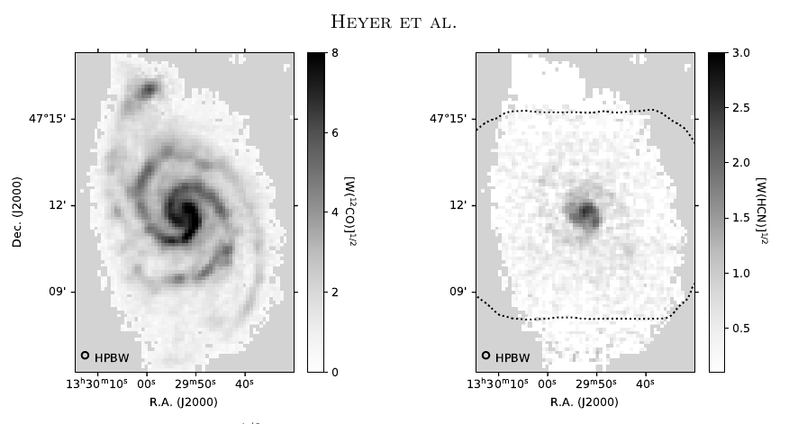

# 2018-S1-MU-8

This project observed NGC5194 (M51) in CO and HCN. Results from these data were published on
arXiv (accepted for publication in ApJ on April 15, 2022) - [Heyer et. al 2022]
See https://arxiv.org/abs/2204.09613

The data produced for the paper were processed with the very first version
of the pipeline (at the time named lmtoy_reduce.sh and lmtoy_combine.sh), not this version [lmtoy 0.5 - spring 2022].
The purpose of these scripts is not to reproduce the exact data presented in the paper, but
to show a path to reproduce them, and provide a template for other projects.

## OBSNUM

A total of 99 science obsnum's were taken, 77 in the HCN line (88.6 GHz) and 22 in the CO line (115.3 GHz).
The data were taken in a nine week campaign between 15-jan-2020 and 13-mar-2020, the day of the COVID shutdown!
Each observation covered (most of) the galaxy in about 20 minutes of integration time in an OTF style.

Most obsnums are in **2018-S1-MU-8**, but by accident a few are in **2018S1-MU-8**.
More detailed descriptions are in the file **mk_runs**.

All data prior to xx-feb-2020 suffered from a hardware bug that causes RMS variations. High values will need
to be clipped, and causes about xx% of the data to be flagged.

## LMTOY Data Reduction

There are two ways to run the SLpipeline, using a different $WORK_LMT directory where the root
of the data processing occurs

1. Use the WORK_LMT that came with where **lmtoy** was installed. This will likely require
   write permission from the owner

   This is the way it runs on Unity.

2. Set WORK_LMT to a directory here in this directory,  something like

              WORK_LMT=`pwd`

   and no permissions in the $LMTOY tree are. Of course you still need to have LMTOY
   installed. The pipeline will then create all  data products in this local directory.

### Creating the run files

A master script **mk_runs** contains all the information on which obsnums are good,
which beams are good, etc.  You always will need to re-run this script to create the
SLpipeline *run* files. The script also uses the (optional) **OBSNUM.args** files, where
arguments specific to this obsnum can be stored. These files should be edited by
a user to create a new "final" dataset. Any optional post-processing after the
pipeline will not be described here (but is of course recommended?).

This command creates the run files (it uses the **mk_runs** scripts):

      make runs
	  
in this case just **m51.run1** and **m51.run2**

### Running the pipeline

With [SLURM](https://slurm.schedmd.com/documentation.html) this is the way:

      sbatch_lmtoy m51.run1
      # wait for it to finish
      sbatch_lmtoy m51.run2

whereas with [Gnu Parallel](https://www.gnu.org/software/parallel/)

      parallel --jobs 16 m51.run1
      parallel --jobs 16 m51.run2

can be submitted in a shell as the seond one will wait until the first one has finished
all pipeline calls. On "lma" this takes about 30 minutes to process all single obsnums
(run1) and a few combination maps (run2)

If you have no good parallel/batch processing available, the slow and trusted way is
via your [unix shell](https://www.gnu.org/software/bash/):

      bash m51.run1
      bash m51.run2

but this will take a while of course (5:04 hours on "lma"):

### Alternate ProjectId's

For the M51 project by accident the ProjectId during one night (2020-02-13, see **lmtinfo.log**)
was given the wrong name. In addition one pointing observation was stored under
2018S1SEQUOIACommissioning.

It may in fact be diserable to add certain pointing observations to the dataset, to confirm
that pointing was optimal. most (all?) osbervations have (or should have) a regular pointing done
before, maybe during, and after an observation. In theory one could use a cross-correlatoin
technique to convince oneselves that the data are safe to stack.  *we will be looking into this*

## Files:

Description of the file that should be in this directory

      do_MU-8p        the original messy script that was used for testing
      lmtinfo.log     logfile from lmtinfo.py on all relevant science observations
      mk_runs         script to make the run files
      m51.run1        created by mk_runs
      m51.run2        created by mk_runs
      m51.png         figure 1 from the paper
      2018-S1-MU-8/   (optional) directory with pipeline results, otherwise in $WORK_LMT
      2018S1-MU-8/    (optional) directory with pipeline results, otherwise in $WORK_LMT
